# CI/CD Pipeline Documentation

Complete guide to our Continuous Integration and Continuous Deployment pipelines.

## 📚 Table of Contents

- [Overview](#overview)
- [Architecture](#architecture)
- [Workflows](#workflows)
- [Setup Guide](#setup-guide)
- [Usage](#usage)
- [Security](#security)
- [Monitoring](#monitoring)
- [Troubleshooting](#troubleshooting)

## 🎯 Overview

Our CI/CD pipeline is built on GitHub Actions and provides:

- **Automated CI checks** on every PR (lint, test, typecheck, build)
- **Mobile builds** via Expo EAS for iOS and Android
- **Backend deployment** to AWS ECS using Docker and OIDC authentication
- **Frontend deployment** to Vercel or AWS CloudFront
- **Multi-workspace support** with Turborepo for efficient caching
- **Environment separation** (staging and production)
- **Security-first approach** using AWS OIDC (no long-lived credentials)

### Key Features

✅ **Fast CI**: Parallel jobs with Turborepo caching  
✅ **Secure**: AWS OIDC authentication, no stored credentials  
✅ **Flexible**: Manual deployment triggers via workflow_dispatch  
✅ **Comprehensive**: Unit tests, integration tests, e2e tests  
✅ **Observable**: Detailed logs, deployment summaries, PR comments  

## 🏗️ Architecture

### Workflow Structure

```
.github/workflows/
├── ci.yml                    # Main CI pipeline (PR checks)
├── deploy-mobile.yml         # Expo EAS mobile builds
├── deploy-backend.yml        # AWS ECS backend deployment
├── deploy-admin-web.yml      # Vercel/CloudFront frontend deployment
├── README.md                 # Workflow documentation
└── secrets.example.md        # Secrets configuration guide
```

### CI Pipeline Flow

```mermaid
graph LR
    A[Push/PR] --> B[Setup & Cache]
    B --> C[Lint]
    B --> D[Typecheck]
    B --> E[Unit Tests]
    B --> F[Integration Tests]
    B --> G[Build]
    B --> H[Format Check]
    C --> I[Status Check]
    D --> I
    E --> I
    F --> I
    G --> I
    H --> I
    I --> J{All Pass?}
    J -->|Yes| K[✅ Allow Merge]
    J -->|No| L[❌ Block Merge]
```



### Deployment Flow


## 🔄 Workflows

### 1. CI Pipeline (`ci.yml`)

**Purpose**: Ensure code quality and prevent broken code from being merged.

**Trigger**: Automatically on:
- Pull requests to `main` or `develop`
- Pushes to `main` or `develop`

**Jobs**:

| Job | Description | Workspaces |
|-----|-------------|------------|
| `setup` | Installs dependencies, sets up caching | All |
| `lint` | Runs ESLint | All workspaces |
| `typecheck` | Runs TypeScript compiler | All workspaces |
| `test-unit` | Runs unit tests | backend, packages/* |
| `test-integration` | Runs integration tests with DB | backend |
| `build` | Builds applications | backend, admin-web, mobile |
| `format-check` | Checks code formatting | All |
| `status-check` | Aggregates results | - |

**Matrix Strategy**: Jobs run in parallel for each workspace, maximizing speed.

**Caching**: 
- pnpm store cache
- Turborepo cache
- Node modules cache

### 2. Mobile Deployment (`deploy-mobile.yml`)

**Purpose**: Build and distribute mobile applications via Expo EAS.

**Trigger**: Manual via workflow_dispatch

**Parameters**:
- `platform`: ios | android | all
- `profile`: development | preview | production
- `environment`: staging | production

**Build Profiles**:

| Profile | Distribution | Purpose |
|---------|--------------|---------|
| `development` | Internal | Development builds with debugging |
| `preview` | Internal | Testing builds for QA |
| `production` | Store | Release builds for app stores |

**Process**:
1. Setup Node.js and pnpm
2. Install Expo CLI and EAS CLI
3. Configure app.json and eas.json
4. Trigger EAS build (async)
5. Post build link to PR (if applicable)

**Output**: Build link at https://expo.dev

### 3. Backend Deployment (`deploy-backend.yml`)

**Purpose**: Deploy backend API to AWS ECS using Docker containers.

**Trigger**: Manual via workflow_dispatch

**Parameters**:
- `environment`: staging | production

**Process**:
1. Build backend application
2. Authenticate with AWS using OIDC
3. Build Docker image (multi-stage)
4. Push image to Amazon ECR
5. Update ECS task definition
6. Deploy to ECS Fargate
7. Run database migrations
8. Verify health check

**Infrastructure**:
- **Container Registry**: Amazon ECR
- **Compute**: AWS ECS Fargate
- **Database**: Amazon RDS PostgreSQL
- **Load Balancer**: Application Load Balancer

**Security**:
- AWS OIDC authentication (no stored credentials)
- IAM roles with least privilege
- Secrets stored in GitHub Secrets
- Environment variable injection

### 4. Admin Web Deployment (`deploy-admin-web.yml`)

**Purpose**: Deploy Next.js admin application to Vercel or AWS CloudFront.

**Trigger**: Manual via workflow_dispatch

**Parameters**:
- `environment`: staging | production
- `target`: vercel | cloudfront

**Deployment Targets**:

#### Vercel
- Serverless deployment
- Automatic preview URLs
- Edge network CDN
- Built-in analytics

#### CloudFront
- Static export to S3
- CloudFront CDN distribution
- Custom cache policies
- Lower cost for high traffic

**Process**:

**Vercel**:
1. Build Next.js app
2. Deploy using Vercel CLI
3. Get deployment URL

**CloudFront**:
1. Build Next.js static export
2. Sync to S3 bucket
3. Invalidate CloudFront cache
4. Verify deployment

## 🚀 Setup Guide

### Prerequisites

- GitHub repository with Actions enabled
- AWS account (for backend/CloudFront deployments)
- Expo account (for mobile builds)
- Vercel account (optional, for admin web)

### Step 1: Configure AWS OIDC

See detailed guide in `.github/workflows/secrets.example.md`

**Quick Setup**:

```bash
# Create OIDC provider
aws iam create-open-id-connect-provider \
  --url https://token.actions.githubusercontent.com \
  --client-id-list sts.amazonaws.com \
  --thumbprint-list 6938fd4d98bab03faadb97b34396831e3780aea1

# Create IAM role with trust policy
aws iam create-role \
  --role-name GitHubActionsRole \
  --assume-role-policy-document file://trust-policy.json

# Attach policies
aws iam attach-role-policy \
  --role-name GitHubActionsRole \
  --policy-arn arn:aws:iam::aws:policy/AmazonEC2ContainerRegistryPowerUser

aws iam attach-role-policy \
  --role-name GitHubActionsRole \
  --policy-arn arn:aws:iam::aws:policy/AmazonECS_FullAccess
```

### Step 2: Configure GitHub Secrets

Navigate to: `Settings → Secrets and variables → Actions`

**Required for all workflows**:
```
AWS_ROLE_ARN=arn:aws:iam::123456789012:role/GitHubActionsRole
AWS_REGION=us-east-1
```

**For mobile**:
```
EXPO_TOKEN=<from expo whoami --json>
STAGING_API_URL=https://api-staging.example.com
PRODUCTION_API_URL=https://api.example.com
```

**For backend**:
```
ECR_REPOSITORY_BACKEND=backend
ECS_CLUSTER=production-cluster
ECS_SERVICE_BACKEND=backend-service
ECS_TASK_DEFINITION_BACKEND=backend-task
SUBNET_ID=subnet-12345abcde
SECURITY_GROUP_ID=sg-12345abcde
API_URL=https://api-staging.example.com
```

**For admin web (Vercel)**:
```
VERCEL_TOKEN=<from Vercel account settings>
VERCEL_ORG_ID=<from Vercel project>
VERCEL_PROJECT_ID=<from Vercel project>
NEXT_PUBLIC_API_URL=https://api-staging.example.com
```

**For admin web (CloudFront)**:
```
S3_BUCKET_ADMIN_WEB=admin-web-staging
CLOUDFRONT_DISTRIBUTION_ID=E1234ABCDEFGH
CLOUDFRONT_URL=https://d111111abcdef8.cloudfront.net
NEXT_PUBLIC_API_URL=https://api-staging.example.com
```

### Step 3: Create GitHub Environments

1. Go to: `Settings → Environments`
2. Create `staging` environment
3. Create `production` environment
4. For production, add:
   - Required reviewers (team leads)
   - Deployment branches (only `main`)
   - Environment protection rules

### Step 4: Configure Branch Protection

1. Go to: `Settings → Branches`
2. Add rule for `main` branch:
   - ✅ Require pull request reviews
   - ✅ Require status checks: `CI Status Check`
   - ✅ Require branches to be up to date
   - ✅ Include administrators
   - ✅ Restrict who can push

### Step 5: Test Workflows

1. Create a test branch
2. Make a small change
3. Open a PR → CI should run
4. Trigger a staging deployment manually
5. Verify everything works

## 📖 Usage

### For Developers

#### Making a Pull Request

```bash
# Create feature branch
git checkout -b feature/my-feature

# Make changes and commit
git add .
git commit -m "feat: add new feature"

# Push and create PR
git push origin feature/my-feature
```

**PR checks will automatically run**:
- Lint
- Typecheck
- Tests
- Build
- Format check

**All checks must pass** before the PR can be merged.

#### Running Checks Locally

Before pushing, run checks locally:

```bash
# Run all checks
pnpm lint
pnpm typecheck
pnpm test
pnpm build
pnpm format:check

# Or fix formatting issues
pnpm format
```

### For Deployment

#### Deploying Mobile App

1. Go to: `Actions → Deploy Mobile - EAS Build`
2. Click "Run workflow"
3. Select:
   - Platform: `ios`, `android`, or `all`
   - Profile: `preview` (for staging) or `production`
   - Environment: `staging` or `production`
4. Click "Run workflow"
5. Monitor progress in Actions tab
6. Get build link from Expo dashboard

**Build times**:
- iOS: ~15-20 minutes
- Android: ~10-15 minutes

#### Deploying Backend

1. Go to: `Actions → Deploy Backend to AWS`
2. Click "Run workflow"
3. Select environment: `staging` or `production`
4. Click "Run workflow"
5. Monitor deployment:
   - GitHub Actions logs
   - AWS ECS console
6. Verify health check: `https://api.example.com/api/health`

**Deployment time**: ~5-10 minutes

**Rollback**:
```bash
# In AWS Console: ECS → Services → Update Service
# Select previous task definition revision
```

#### Deploying Admin Web

**To Vercel**:
1. Go to: `Actions → Deploy Admin Web`
2. Click "Run workflow"
3. Select:
   - Environment: `staging` or `production`
   - Target: `vercel`
4. Click "Run workflow"
5. Check deployment URL in Vercel dashboard

**To CloudFront**:
1. Go to: `Actions → Deploy Admin Web`
2. Click "Run workflow"
3. Select:
   - Environment: `staging` or `production`
   - Target: `cloudfront`
4. Click "Run workflow"
5. Wait for cache invalidation (~2-5 minutes)
6. Verify at CloudFront URL

## 🔐 Security

### Authentication

- **AWS**: OIDC with temporary credentials (no access keys)
- **Expo**: Token-based authentication
- **Vercel**: API token (stored securely)

### Secrets Management

- All secrets stored in GitHub Secrets
- Environment-specific secrets in GitHub Environments
- No secrets in code or logs
- Regular rotation schedule (every 90 days)

### Permissions

- **Workflows**: Minimal required permissions
- **IAM Roles**: Least privilege principle
- **GitHub**: Required reviews for production

### Best Practices

✅ Use AWS OIDC instead of access keys  
✅ Rotate secrets regularly  
✅ Use environment protection for production  
✅ Review deployment logs  
✅ Enable branch protection  
❌ Never commit secrets  
❌ Never bypass required checks  
❌ Never deploy directly to production  

## 📊 Monitoring

### CI Pipeline

**Metrics to watch**:
- Build duration
- Test pass rate
- Failure patterns
- Cache hit rate

**Access**:
- GitHub Actions tab
- PR checks section
- Commit status API

### Deployments

**Health Checks**:
- Backend: `/api/health` endpoint
- Admin Web: Root URL response
- Mobile: App launch metrics in Expo

**Logs**:
- Backend: AWS CloudWatch Logs
- Admin Web: Vercel logs / CloudFront logs
- Mobile: Expo dashboard

**Alerts**:
Configure GitHub Actions notifications:
1. Go to: Profile → Settings → Notifications
2. Enable: Actions workflow runs

## 🔧 Troubleshooting

### CI Failures

#### Lint Errors

```bash
# View errors
pnpm lint

# Auto-fix
pnpm lint --fix

# Format code
pnpm format
```

#### Test Failures

```bash
# Run specific test
pnpm --filter backend test -- path/to/test

# Run with coverage
pnpm --filter backend test:cov

# Run in watch mode
pnpm --filter backend test:watch
```

#### Build Failures

```bash
# Clean and rebuild
pnpm clean
pnpm install
pnpm build

# Check for type errors
pnpm typecheck
```

### Deployment Failures

#### AWS Authentication Failed

**Symptoms**: `Error: Credentials could not be loaded`

**Solutions**:
1. Verify OIDC provider exists in AWS
2. Check trust policy includes correct repository
3. Verify `AWS_ROLE_ARN` secret is correct
4. Check IAM role has required permissions

#### ECS Deployment Failed

**Symptoms**: `ECS service failed to stabilize`

**Solutions**:
1. Check CloudWatch logs for container errors
2. Verify environment variables are set
3. Check security group allows necessary traffic
4. Ensure health check path is correct
5. Verify task has sufficient memory/CPU

#### Expo Build Failed

**Symptoms**: `EAS build failed`

**Solutions**:
1. Check Expo dashboard for error details
2. Verify `EXPO_TOKEN` is valid
3. Check `app.json` configuration
4. Ensure account has build quota
5. Review build logs in Expo

#### Vercel Deployment Failed

**Symptoms**: `Vercel deployment failed`

**Solutions**:
1. Verify `VERCEL_TOKEN` is valid
2. Check project IDs are correct
3. Ensure build completes locally
4. Review Vercel deployment logs
5. Check environment variables

### Common Issues

#### Cache Issues

```bash
# Clear GitHub Actions cache
# Go to: Actions → Caches → Delete

# Clear local cache
pnpm clean
rm -rf node_modules
pnpm install
```

#### Permission Denied

```bash
# Verify IAM role permissions
aws iam get-role-policy --role-name GitHubActionsRole --policy-name <policy-name>

# Check repository secrets
# Go to: Settings → Secrets and variables
```

#### Slow CI

**Optimizations**:
- Use Turborepo remote caching
- Reduce test parallelism if OOM
- Split large test suites
- Use matrix strategy effectively

## 📚 Additional Resources

- [GitHub Actions Documentation](https://docs.github.com/en/actions)
- [Turborepo CI Guide](https://turbo.build/repo/docs/ci)
- [AWS OIDC Guide](https://docs.github.com/en/actions/deployment/security-hardening-your-deployments/configuring-openid-connect-in-amazon-web-services)
- [Expo EAS Build](https://docs.expo.dev/build/introduction/)
- [Vercel Deployment](https://vercel.com/docs/deployments/overview)

## 🤝 Contributing

### Adding New Workflows

1. Create workflow file in `.github/workflows/`
2. Test on feature branch
3. Document in this file
4. Update secrets guide
5. Create PR with changes

### Modifying Existing Workflows

1. Create feature branch
2. Edit workflow file
3. Test thoroughly
4. Document changes
5. Request review from DevOps team

### Workflow Standards

- Use descriptive job names
- Add comments for complex steps
- Include error handling
- Set appropriate timeouts
- Use matrix strategy when possible
- Cache dependencies
- Provide deployment summaries

---

**Last Updated**: 2024
**Maintained By**: DevOps Team
**Contact**: Create an issue for questions
